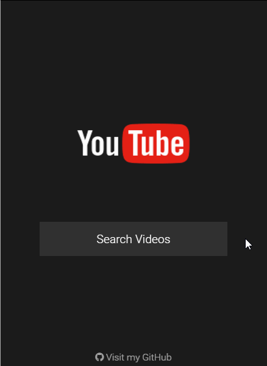

# Youtube App
####Simple Youtube-like Application to search videos using Youtube API



## Config

You'll need to request an API Key and register your application, you can follow Google's instructions [here](https://developers.google.com/youtube/v3/getting-started#before-you-start).
After you get your API Key, insert it in the file `src/actions/videosActions.js` line 4 and start the server.

## Install

```sh
$ npm install
```

## Usage

```sh
$ npm run server
```

```sh
$ localhost:8080
```
